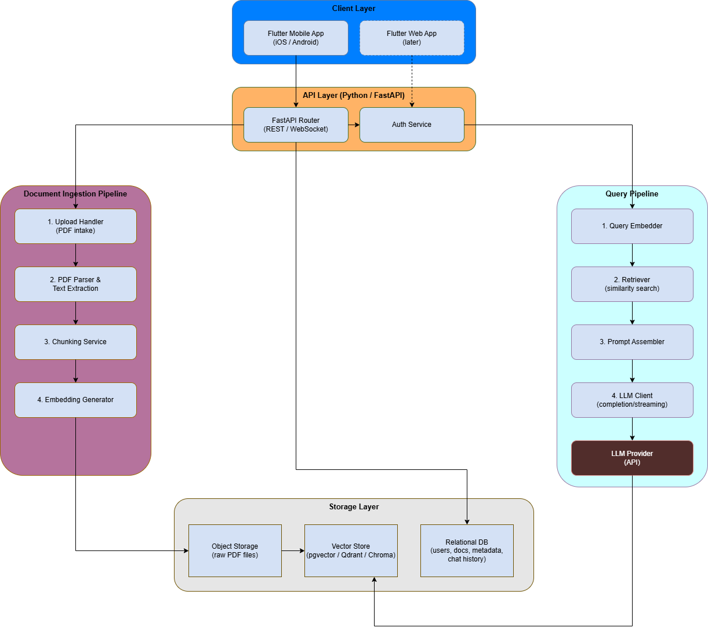

# RAG Backend

A Python/FastAPI backend that powers a Retrieval-Augmented Generation (RAG) pipeline for PDF documents. Upload a PDF, it gets chunked and embedded into a vector store, then you can ask natural-language questions and get answers grounded in the document's content.

Built as the server-side component of a Flutter mobile app (with a web client planned later).

## Live API

Deployed on Render: **https://rag-backend-sr99.onrender.com**

Interactive API docs (Swagger UI): **https://rag-backend-sr99.onrender.com/docs**


## How it works

1. **Upload** — a PDF is uploaded, text is extracted page by page
2. **Chunk** — extracted text is split into overlapping character-based chunks
3. **Embed** — each chunk is turned into a vector via Voyage AI
4. **Store** — chunks and their vectors are saved in Postgres (with the `pgvector` extension)
5. **Query** — a question is embedded the same way, the closest chunks are retrieved via cosine similarity search, and an LLM (Google Gemini) generates an answer using only that retrieved context

## Tech stack

- **FastAPI** — API framework
- **pypdf** — PDF text extraction
- **Voyage AI** (`voyage-2`) — embeddings
- **PostgreSQL + pgvector** — vector storage and similarity search
- **Google Gemini** (`gemini-3-flash-preview`, via the `google-genai` SDK) — answer generation
- Deployed on **Render**

## Project structure

```
rag-backend/
├── main.py
├── routers/
│   └── documents.py
├── rag_modules/
│   ├── chunking.py
│   ├── embeddings.py
│   ├── llm_client.py
│   └── storage.py
├── schema/
│   └── schemas.py
├── uploads/
│   ├── __init__.py
│   └── *.pdf
├── images/
│   └── Architecture_diagram.png
├── test.py
├── .env
├── .gitignore
└── requirements.txt
```


## Status

v1 of an incrementally-built RAG system — a working end-to-end pipeline (upload → chunk → embed → store → query → grounded answer), paired with a Flutter mobile client. Chunking is currently simple character-window splitting; retrieval is single-document, top-k cosine similarity with no re-ranking yet.

### Planned next
- Smarter chunking (sentence/paragraph aware)
- Multi-document and multi-turn conversation support
- Streaming responses
- Web client

